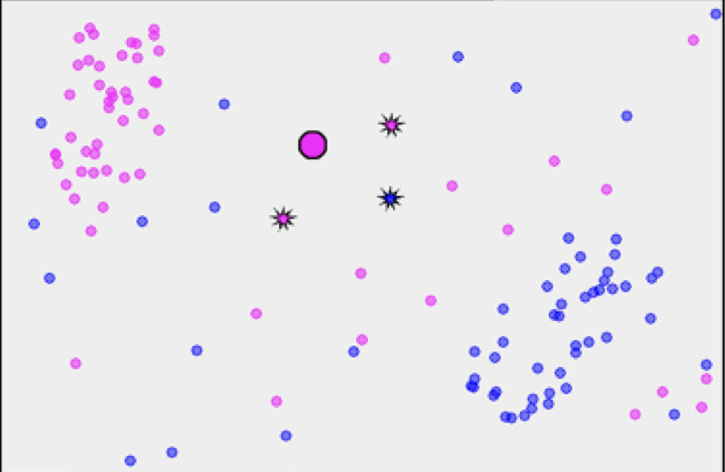

# KNN (K Nearest Neighbour)

KNN is a Supervised Machine Learning algorithm that classifies a data point based on how its neighbours are classified.
KNN is based on feature similarity.

---

<aside>
📌 **Algorithm**
1) Positive integer K is specified along with New Sample/Test Sample.
2) Distance between New Data Point and each Training Data Point is calculated.
3) The Nearest K Training Data Point is chosen.
4) Out of K nearest Neighbours, Data Points are counted based on their features.
5) The feature having maximum count is assigned to the new Data Point.

</aside>

---

Distance between the Data Points is calculated Using,
**Euclidean Distance**
Euclidean Distance between $(X_1,Y_1)$ and $(X_2,Y_2)$ is

 $\sqrt {(X_1-X_2)^2 + (Y_1-Y_2)^2}$
**Manhattan Distance** 
Euclidean Distance between $(X_1,Y_1)$ and $(X_2,Y_2)$ is

$|X_1-X_2| + |Y_1-Y_2|$

---

### Example :

Source: Oliver Sutton

In the above Image Two Sets of Data Points are plotted with varying feature (Colour — Pink and Blue).

Source: Oliver Sutton

Here K is 3,The enlarged circle is the New Data Point.The highlighted dots are KNN Data Points where out 3, 2 has Pink Colour and 1 has Blue Colour hence New Data Point is classified as Pink.

---

### Questions :

**1) Mention some of the other methods of measuring distance ?**

> **Hamming Distance**
Its used for Categorical Values,It tells us if the Categorical Values are same or not.
For Example, Hamming Distance between Medium and Small is 1 while that between Large and Large is 0.
**Minkowski Distance**
Minkowski Distance between $(X_1,Y_1)$ and $(X_2,Y_2)$ is
$(|X_1-X_2|^p + |Y_1-Y_2|^p)^{\frac{1}{p}}$
where $p$ is a real value, Usually set between 1 and 2.
> 

**2) How is the value of K chosen ?**

> The Value of K is chosen such that, Graph of **K vs Accuracy** is plotted and K is chosen, that performs the best.
> 

**3) What are thew Pros and Cons of KNN ?**

> **Pros**
1) Non-Parametric — No Assumptions are made.
2) Training step is much faster compared to other Algorithms as Training doesn’t happen as all the data is used during Prediction.
**Cons**
1) Computationally expensive as it searches for KNN.
2) High Memory requirement as it stores all the Data points.
>
