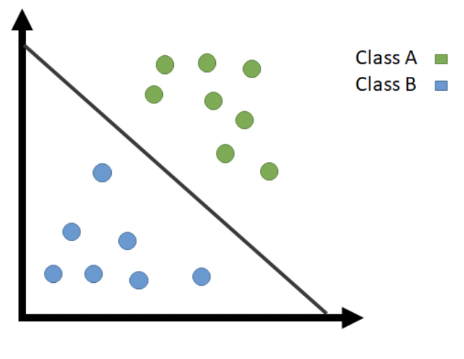
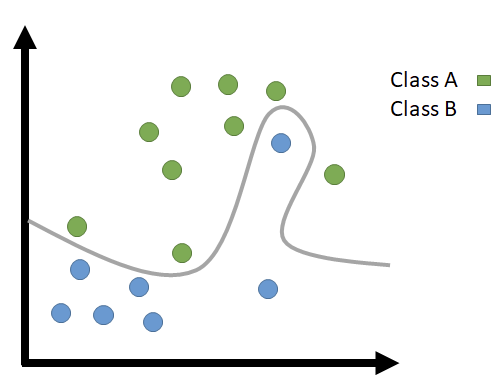

# Support Vector Machine

SVM help us find Non-Linear Decision boundaries.
SVM is a Supervised Machine Learning Algorithm which can be used for both Classification and Regression.

<aside>
📌 **Terminology
HyperPlane**
A decision boundary used to separate and classify Data. It is of (n-1) dimensions where n is number of features.
**Support Vectors**
Vectors\Points that are closest to HyperPlane in each class
**Margin**
The distance between Hyperplane and Supporting Vector

</aside>

> Here the target DataSet is Labelled as -1 and 1 as in Logistic Regression Labelled as 0 and 1
> 

---

### Linear SVM (Optimal Margin Classifier)

<aside>
📌 Here it’s assumed that the Data Points are Linearly Separable

</aside>

(Source — Medium.com)Class A and B are divided using Linear Decision Boundary

Functional Margin :

Geometric Margin :

$X = \begin{bmatrix}X_1\\X_2\\\vdots\\X_n\end{bmatrix}$ and $W = \begin{bmatrix}W_1\\W_2\\\vdots\\W_n \end{bmatrix}$

Here $g(X)$ represents the Hyperplane,

$g(X) = W^TX+b$

where, 
$b$ — Bias/Intercept
$n$ — Number of Features
$W$  — Weight/Regression Coefficients
$Y'$ — Predicated Class

Equation of Hyperplane is $W^TX+b = 0$ and Class A is labelled as 1 
($Y' = 1$) while that of Class B is -1 ($Y' = -1$ ),

$W^TX+b = 1$ for $Y' = 1$

$W^TX+b = -1$ for $Y' = -1$

On combining the above 2 equations,

$(W^TX+b)Y' \geq -1$

](Images/image2.png)

Source: [Medium.com](http://Medium.com)

<aside>
📌 **Calculating the Margin**
In this case (Considering 2 Features),
Distance between HyperPlane and the Supporting Vector is
$\frac{| W^TX+b|}{||W||} = \frac{1}{||W||}$
The Value of Margin is $\frac{2}{||W||}$ (Since 2 Features)

</aside>

Here our aim is to Maximise the Margin which is to reduce the value of $||W||$

The objective function of Linear SVM,

$\min[\frac{{||W||}^2}{2}]$ 

### Kernel

)Class A and B are separated using Non-Linear Function](Images/image3.png)

(Source: [Medium.com](http://Medium.com))Class A and B are separated using Non-Linear Function

For the Data Sets which can be separated better using Polynomial Function, **Kernel Function** is used. Kernel Function transforms data, most likely to be Linearly Separable.

$K(X_a,X_b) = (\gamma(X_a.X_b)+r)^d$

$\gamma$ — Kernel Coefficient
$(X_a,X_b)$ — Are two different features

<aside>
📌 **Gaussian Radial Bias Function (RBF)**
This Kernel works when there is no prior knowledge about the data.
$K(X_a,X_b) = \displaystyle e^{-\displaystyle\gamma||X_a-X_b||^2}$

</aside>

### Non-Linear SVM

Linearly Non-separable Data points are handled using **Non-Linear SVM**.

(Source — Medium.com)Class A and B are divided using Non-Linear Decision Boundary

Here Linear SVM is used but it is allowed to make some mistakes, Which is called as Soft-Margin SVM.

$\min[\frac{{||W||}^2}{2} + C\displaystyle\sum_{i = 1}^{m}\xi_i]$

where, $(W^TX+b)Y' \geq -1 - \xi$  $(\xi \geq0)$

$\xi$ — Slack Variable/Penalty which tells the distance between misclassified Data Point and Class Margin.
$C$ — Regularisation Parameter

### Questions

**1) How can Kernel be used for Linear SVM ?**

> Kernel is used for Linearly Separable data to speed up the calculation of SVM Classifier,
$K(X_a,X_b) = X_a.X_b$
> 

**2) How does “$C$” help in Non-Linear SVM ?**

> $C$ is multiplied so that SVM doesn’t try hard to separate the data (For lower values of $C$), which produces generalised model.
>
